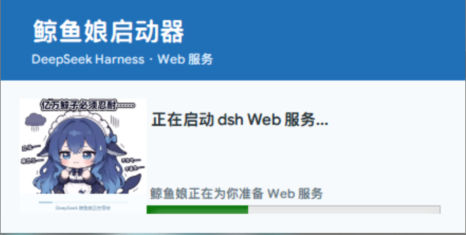

# 🐋 DeepSeek Harness Whale Girl Launcher (Portable)

[中文](README.md) | English

> Whale Girl Launcher for DeepSeek Harness Web

A portable, no-install launcher for DeepSeek Harness Web on Windows: **download and run, no administrator rights required, no manual Node.js or plugin setup**.

It prepares the DeepSeek Harness (`dsh`) runtime, installs the `dsh-power-button` power button plugin and the `dshmarket` plugin marketplace, starts the DeepSeek Harness Web service, and lets you choose which browser to use for the session — opening it in a standalone Web app window with the Whale Girl startup animation and branded icon.

---

## ✨ Features

| Feature | Description |
| --- | --- |
| 🐋 Whale Girl animation | Startup animation with live status text |
| 🚀 One-click install & launch | Automatically installs / locates dsh and starts the Web service |
| 🔌 dsh-power-button | Floating corner button: restart / stop-only / online status dot |
| 🧩 dshmarket marketplace | Installed automatically for browsing community plugins |
| 🖥️ Browser selection | Scans Edge / Chrome / Brave / Chromium on every launch |
| 🪟 Standalone Web window | Centered window using an isolated browser profile |
| 🔐 Keeps browser data intact | Never clears sign-in or other browser settings |
| 📝 Logging | Runtime and error logs written to your user directory |

---

## 🚀 Quick Start

### 1. Get the launcher

- Use `DeepSeekHarness.exe` directly (recommended, latest build)

No installation needed — just **double-click to run**.

### 2. Double-click to run

The launcher automatically does the following (the first run requires a network connection):

1. Checks for Node.js — if missing, shows a prompt and opens the Node.js download page
2. Installs (or locates an existing) DeepSeek Harness (`@deepseek-ai/dsh`)
3. Prepares the dsh user profile and installs plugin dependencies
4. Changes the Web page title to "Whale Girl is ready, let's set sail!"
5. Starts the dsh Web service (default port 3080)

### 3. Choose a browser and start using it

Once started, it lists the Chromium-based browsers detected on this machine. Pick the one to use for this session and DeepSeek Harness Web opens in a standalone window.

---

## 🖥️ System Requirements

### Runtime

- Windows 10 / Windows 11
- Node.js (with npm)
- At least one available Chromium-based browser: Microsoft Edge, Google Chrome, Brave, or Chromium

> **About pnpm**: the launcher prefers an installed `pnpm`; if none is present, it temporarily invokes `npx pnpm` through the existing `npm`. Regular users do **not** need to install pnpm separately.

### Build environment (developers only)

- .NET Framework 4.x with the C# compiler (`csc.exe`)
- Node.js

Regular users need no compiler toolchain — just run `DeepSeekHarness.exe`.

---

## 📖 Usage

### Startup screen

Double-clicking the exe shows the Whale Girl startup screen:

- Top title: 鲸鱼娘启动器 / DeepSeek Harness · Web service
- Left: Whale Girl animation
- Middle: live status text (e.g. "正在启动 dsh Web 服务...")
- Bottom: progress bar



### Choosing a browser

Every launch re-scans local browsers and shows a chooser ("鲸鱼娘要使用哪个浏览器？"). The chosen browser is used for this session; click "使用此浏览器" to confirm.

### Standalone Web window

- Opens in `--app` mode, looking like an independent app window
- Centered, roughly 1200×800 by default (auto-fits the screen, minimum 640×480)
- Uses an isolated browser profile directory (see "Data & Log Locations" below) and does **not** reuse your everyday browser's sign-in state or settings

### Power button (dsh-power-button)

The launcher automatically installs the power-button plugin, which shows a floating button in the bottom-right corner of DeepSeek Harness Web:

- **Main button**: restarts the current dsh service and re-listens on the service port (`dsh-restart`)
- **Secondary button**: stops the current dsh service only and releases the port (`dsh-stop`)
- **Status dot**: shows whether the service is online, offline, or restarting

The plugin comes from a separate repository and is installed from GitHub on first run:

https://github.com/huasheng33991/dsh-power-button

### Service management

Besides the floating button, starting the service can also be handled by the launcher:

- When the service is not running, double-clicking `DeepSeekHarness.exe` installs and starts it automatically
- When the service is already running, re-running the exe simply opens the standalone window without reinstalling or restarting

### Plugin marketplace (dshmarket)

Installs the latest stable `dshmarket` , letting you browse and install community plugins from the DeepSeek Harness Web UI.


The plugin comes from a separate repository and is installed from GitHub on first run:

https://github.com/awesome-dsh-plugin/awesome-dsh-plugin

---

## 📂 Data & Log Locations

| Content | Location |
| --- | --- |
| dsh user profile (plugins, config) | `%USERPROFILE%\.dsh\profiles\web` |
| Runtime log (stdout) | `%USERPROFILE%\dsh-web.log` |
| Error log | `%USERPROFILE%\dsh-web.err.log` |
| Isolated browser profile | `%LOCALAPPDATA%\DeepSeekHarness\BrowserProfile` |
| Service port | default `3080` (per actual dsh output) |

> Note: the launcher does **not** clear or modify your everyday browser's sign-in, settings, or cookies; the standalone window uses a separate browser profile directory.

---

## ❓ FAQ

### What if it says "未检测到 Node.js" (Node.js not detected)?

Install Node.js and run again. The launcher shows a prompt and opens the official download page:

https://nodejs.org/en/download

### What does the first run download?

- `@deepseek-ai/dsh` (DeepSeek Harness itself)
- dsh profile dependencies (`dsh-power-button`, `dshmarket`, `dsh-base`, `dsh-web-app`)

All are installed from npm over the network, so keep the connection available; if installation is slow or fails, consider configuring an npm registry mirror and retrying.

### Why does the launcher prefer pnpm?

`pnpm` is faster and stricter about dependency handling. The launcher prefers an installed `pnpm` and otherwise temporarily invokes `npx pnpm` — no manual installation needed.

### Can I run multiple instances?

Not recommended. The launcher first checks whether dsh is already running on the service port; if so, it just opens the standalone window instead of reinstalling.

### Does it work on another machine / with another browser?

Yes. The launcher re-scans browsers on every launch; on a new machine, the first run reinstalls dsh and the plugins (the profile is stored per user).

### Will it affect my everyday browser?

No. The standalone window uses `%LOCALAPPDATA%\DeepSeekHarness\BrowserProfile` as an isolated profile, not your everyday browser profile.

### Are administrator rights required?

No. Everything is installed and configured inside your user directory, so no administrator rights are needed.

---

## 🛠️ Troubleshooting

On failure, the launcher shows a clear error message and writes detailed logs to:

- `%USERPROFILE%\dsh-web.log` — dsh stdout
- `%USERPROFILE%\dsh-web.err.log` — dsh stderr

Common errors and fixes:

| Error | Likely cause | Fix |
| --- | --- | --- |
| Node.js not detected | Node.js missing or not on PATH | Install Node.js and retry |
| DeepSeek dsh install failed | Network issue / npm registry unreachable | Check network or configure an npm mirror, then retry |
| dsh plugin dependency install failed (exit code N) | Network issue / pnpm unavailable | Check network and npm logs, then retry |
| dsh-power-button not found after install | Incomplete plugin install | Re-run the launcher |
| dsh process exited with code N | dsh runtime error | Inspect `dsh-web.err.log` |
| dsh Web service not started within 180 s | Slow startup / port in use | Check the logs and retry shortly |
| No browser found | No Chromium-based browser installed | Install Edge / Chrome / Brave and retry |

> Tip: read the logs in Notepad, or with PowerShell
> `Get-Content "$env:USERPROFILE\dsh-web.err.log" -Tail 50`.

---

## 🧑‍💻 Developer Guide

### Project structure

```text
DeepSeekHarness-Whale-Girl-Installer-Launcher/
├── build/
│   └── Program.cs          # WinForms launcher core source (all features)
├── DeepSeekHarness.exe     # Launcher main program (portable, double-click to run)
├── DeepSeekHarness-Whale-Girl-Launcher-v2.0.0.zip  # Release archives
├── deepseek-harness.ico    # Launcher icon (embedded at build time)
├── download.gif            # Whale Girl startup animation (embedded as a resource)
├── startup-preview.png     # Startup screen preview (for docs)
├── LICENSE                 # MIT license
├── README.md               # Chinese documentation
└── README.en.md            # English documentation
```

### Build

From the repository root in PowerShell, using the C# compiler bundled with .NET Framework:

```powershell
& 'C:\Windows\Microsoft.NET\Framework64\v4.0.30319\csc.exe' `
  /target:winexe `
  /platform:anycpu `
  /optimize+ `
  /nologo `
  /win32icon:deepseek-harness.ico `
  /r:System.dll `
  /r:System.Drawing.dll `
  /r:System.Windows.Forms.dll `
  /r:System.Web.Extensions.dll `
  /resource:download.gif,download.gif `
  /out:DeepSeekHarness.exe `
  build\Program.cs
```

### Packaging a release

1. Build `DeepSeekHarness.exe`
2. Archive it as `DeepSeekHarness-Whale-Girl-Launcher-vX.Y.Z.zip`
3. Publish to GitHub Releases (recommended) or distribute the zip / exe directly

> Tip: `AssemblyVersion` / `AssemblyFileVersion` in `Program.cs` are currently `2.0.0.0`; remember to bump them when releasing a new version.

### Roadmap

- [x] Whale Girl startup animation
- [x] Standalone Web window
- [x] Browser selection on every launch
- [x] dsh power-button plugin
- [x] dshmarket plugin marketplace
- [x] Prebuilt Windows release (exe / zip)
- [ ] Launcher auto-update
- [ ] More Chromium-based browser support
- [ ] Chinese / English UI switching

---

## 📜 License

This project is open source under the [MIT License](LICENSE), © 2026 Yutou04-sa.

You are free to use, modify, and distribute it, provided the copyright notice is retained.

---

## 🔗 Project

GitHub:

https://github.com/Yutou04-sa/DeepSeekHarness-Whale-Girl-Installer-Launcher

---

🐋 **Whale Girl is ready, let's set sail!**
